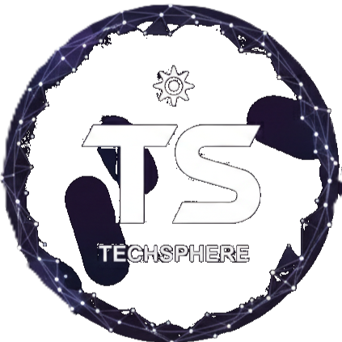

# 🚀 TechSphere Animations

<div align="center">
  

  
  
  
  
  

  <p><em>Interactive 3D visualizations for modern technology concepts</em></p>
</div>

---

## ✨ What is TechSphere Animations?

TechSphere Animations is a cutting-edge web platform that brings technology concepts to life through **interactive 3D animations**. Explore complex tech domains like Full Stack Development, AI/ML, DevOps, and more in an immersive, visual experience.

🎯 **Key Features:**
- **9 Interactive Animations** covering major tech domains
- **Real-time 3D Rendering** with Three.js & React Three Fiber
- **Smooth Animations** powered by Framer Motion
- **PDF Export** functionality for sharing visualizations
- **Responsive Design** that works on all devices
- **Dark Theme** with glassmorphism effects

---

## 🎮 Available Animations

| Animation | Description | Icon |
|-----------|-------------|------|
| **Full Stack Development** | Complete web development workflow | 💻 |
| **AI & Machine Learning** | Neural networks and ML pipelines | 🧠 |
| **DevOps & Cloud** | CI/CD pipelines and cloud architecture | ☁️ |
| **Mobile Development** | Cross-platform mobile app development | 📱 |
| **Database Systems** | Database design and management | 🗄️ |
| **Web3 & Blockchain** | Decentralized applications and crypto | 🌐 |
| **Cybersecurity** | Security concepts and best practices | 🛡️ |
| **IoT & Embedded** | Internet of Things and embedded systems | ⚡ |
| **Backend Development** | Server-side architecture and APIs | 🖥️ |

---

## 🛠️ Tech Stack

- **Frontend:** Next.js 16, React 19, TypeScript
- **3D Graphics:** Three.js, React Three Fiber, Drei
- **Animations:** Framer Motion
- **Styling:** Tailwind CSS 4.0
- **UI Components:** Radix UI
- **State Management:** Zustand
- **Export:** jsPDF, html2canvas

---

## 🚀 Quick Start

### Prerequisites
- Node.js 18+
- npm, yarn, pnpm, or bun

### Installation

```bash
# Clone the repository
git clone https://github.com/yourusername/techsphere-animations.git
cd techsphere-animations

# Install dependencies
npm install
# or
yarn install
# or
pnpm install
# or
bun install
```

### Development

```bash
# Start development server
npm run dev
# or
yarn dev
# or
pnpm dev
# or
bun dev
```

Open [http://localhost:3000](http://localhost:3000) to view the app.

### Build for Production

```bash
# Build the app
npm run build

# Start production server
npm start
```

---

## 🎨 Screenshots

<div align="center">
  
  
  
</div>

---

## 🎯 Usage

1. **Select Animation:** Choose from 9 different tech domain animations
2. **Interact:** Click and drag to rotate, scroll to zoom, right-click to pan
3. **Control:** Use play/pause, reset, and export controls
4. **Export:** Download animations as PDF for presentations or documentation

---

## 🤝 Contributing

Contributions are welcome! Please feel free to submit a Pull Request.

1. Fork the project
2. Create your feature branch (`git checkout -b feature/AmazingFeature`)
3. Commit your changes (`git commit -m 'Add some AmazingFeature'`)
4. Push to the branch (`git push origin feature/AmazingFeature`)
5. Open a Pull Request

---

## 📄 License

This project is licensed under the MIT License - see the [LICENSE](LICENSE) file for details.

---

<div align="center">
  <p>Made with ❤️ using Next.js & Three.js</p>
  <p>⭐ Star this repo if you found it helpful!</p>
</div>
